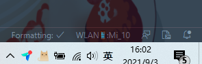
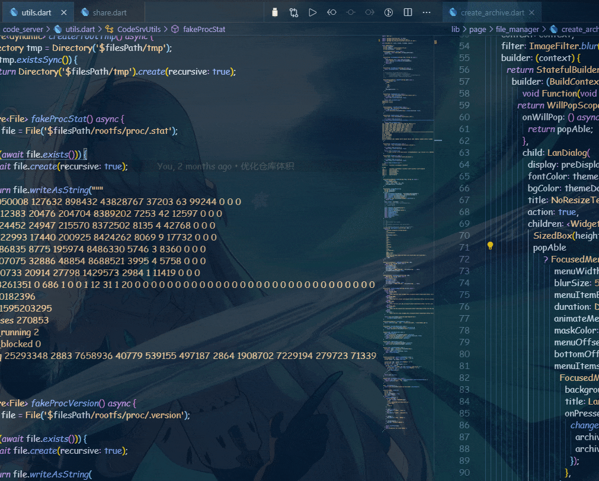

## ANDROID ABD WLAN README

## New Features 0.0.6

1. Support Android R+ wireless debugging.

> - You don't have to enter Paring Code if your OS is Windows or Linux

> - Details <https://developer.android.com/studio/command-line/adb#connect-to-a-device-over-wi-fi-android-11+>

2. Add status bar and devices list.

    

3. Optimize IP selection.

4. Remove keybinding.

## Features

1. Debug through wireless.

2. Supports simultaneous connection of multiple devices.

## Screenshot



## Usage

1. Connect the USB (Android 11+ both USB and Wireless).

2. Make sure that your mobile and PC on the same WLAN.

3. Active extension.

> - Using icon button upper right ⭐

> - Using command `ctrl + shift + p` ;

> ```txt
> Android adb wlan connect
> Android adb wlan restart
> Android adb wlan show devices
> ```

## Recommend my extensions

[Colorful Monorepo](https://marketplace.visualstudio.com/items?itemName=deskbtm.colorful-monorepo&ssr=false#overview)

## Nota Bene

1. **I just tested on Windows and Linux. There is no guarantee that everyone can use it normally**.

2. **Doesn't support Virtual Machine**.

3. The device must be on the same LAN.

4. lf something went wrong you can try restart ADB or report bug to.

5. The primary version is for myself, many devices cloud not work.

Enjoy !
