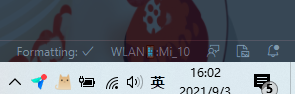
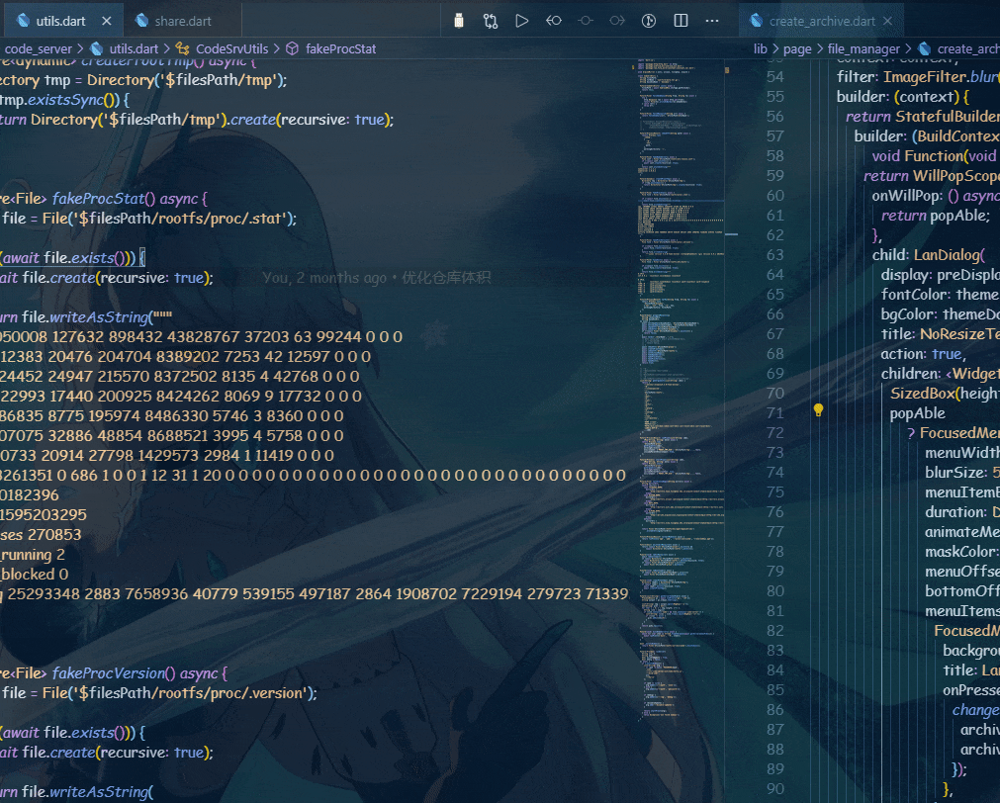

# Android ADB WLAN

[](https://marketplace.visualstudio.com/items?itemName=HanWang.android-adb-wlan)
[](https://marketplace.visualstudio.com/items?itemName=HanWang.android-adb-wlan)
[](LICENSE)

Connect Android phones and tablets to **ADB over Wi-Fi** (wireless debugging) directly from VS Code. Pair with a **QR code** on Android 11+, run **`adb connect`** / **`adb pair`**, or switch from USB on older devices — then work cable-free. Built for **native Android**, **React Native**, and **Flutter** workflows: multi-device picker, recent IP history, mDNS reconnect, and a title-bar shortcut.

## Screenshots

**Device list and status bar**



**End-to-end usage**



## What's New

Recent improvements in this release:

- **QR code pairing (Android 11+)** — Generate an AOSP-compatible pairing QR in VS Code; scan on the phone to pair and connect without typing IP or codes.
- **Recent IP history** — Previously used IPs appear in the Quick Pick; select to fill, or remove entries with the trash icon.
- **Smarter mDNS connect** — When multiple `_adb-tls-connect._tcp` endpoints exist, stale ports (`Connection refused`) are skipped automatically until a working one is found.
- **Test coverage** — Unit tests for parsers and pairing credentials; integration tests for command registration and extension activation.
- **Automated publishing** — Pushing a `v*` tag triggers GitHub Actions to lint, test, and publish to the VS Code Marketplace.

## Table of Contents

- [Screenshots](#screenshots)
- [What's New](#whats-new)
- [Overview](#overview)
- [Features](#features)
- [Requirements](#requirements)
- [Installation](#installation)
- [Getting Started](#getting-started)
- [Connection Workflows](#connection-workflows)
- [Commands](#commands)
- [Troubleshooting](#troubleshooting)
- [Known Limitations](#known-limitations)
- [Development](#development)
- [Related Extensions](#related-extensions)
- [License](#license)

## Overview

Android ADB WLAN wraps common ADB wireless workflows into VS Code commands and UI affordances:

- A title-bar action for quick access
- A status bar indicator for the active device
- A device picker backed by `adb devices -l`
- Automatic LAN IP matching between host and device

The extension shells out to the system `adb` binary. No additional daemon or mobile app is required.

## Features

| Capability | Description |
| --- | --- |
| Wireless debugging | Connect devices over WLAN after setup |
| Multi-device support | View and switch between multiple connected devices |
| USB-assisted setup | Switch a USB-connected device to wireless ADB (Android 10 and below) |
| Android 11+ pairing | Native wireless debugging with `adb pair` / `adb connect` |
| QR code pairing | In-editor QR for **Pair device with QR code** on Android 11+ |
| Recent IP history | Quick Pick list of recent wireless IPs with one-click fill and delete |
| mDNS endpoint retry | Tries all `_adb-tls-connect._tcp` ports when stale entries refuse connections |
| Status bar | Shows the current device model; click to open the device list |
| IP selection | Prefers addresses on the same LAN segment as the host |

## Requirements

| Item | Details |
| --- | --- |
| Editor | VS Code `^1.64.0` or compatible forks |
| Host OS | Windows, macOS, and Linux |
| ADB | [Android SDK Platform-Tools](https://developer.android.com/studio/releases/platform-tools) on `PATH` |
| Network | Phone and computer on the same LAN |
| Device | USB debugging enabled; wireless debugging enabled for Android 11+ |

Verify ADB before using the extension:

```bash
adb --version
adb devices -l
```

## Installation

**From the Marketplace**

1. Open the Extensions view in VS Code (`Ctrl+Shift+X` / `Cmd+Shift+X`)
2. Search for **Android ADB WLAN**, **adb wifi**, **wireless debugging**, or **adb wireless**
3. Click **Install**

Direct link: [Visual Studio Marketplace](https://marketplace.visualstudio.com/items?itemName=HanWang.android-adb-wlan)

## Getting Started

1. Install and configure ADB on your machine.
2. Enable **USB debugging** on the Android device.
3. For Android 11+, also enable **Wireless debugging** under Developer options.
4. Ensure the device and host share the same Wi-Fi network.
5. Launch a connection:
   - Click the ADB icon in the editor title bar, or
   - Open the Command Palette (`Ctrl+Shift+P` / `Cmd+Shift+P`) and run `ADB WLAN: Connect over Wi-Fi`

After a successful connection, the status bar displays the connected device model. Click it to inspect the device list.

## Connection Workflows

### USB-assisted (Android 10 and below)

Use this path when the device is connected over USB (Android 10 and below).

1. Connect the device via USB and authorize the debugging prompt.
2. Run `ADB WLAN: Connect over Wi-Fi` (title-bar ADB icon or Command Palette).
3. Select the USB device from the picker (not the wireless-debugging menu items).
4. Enter a TCP port when prompted (default: `1031`).
5. Choose the device IP address (a matching LAN IP is preferred when available).
6. Remove the USB cable once the success dialog appears.

### Wireless debugging (Android 11+)

Use this path when **Wireless debugging** is enabled on the device.

**Pair with QR code**

1. Run `ADB WLAN: Connect over Wi-Fi` and select **Wireless debugging (Android 11+)**.
2. In the address prompt, select **Generate pairing QR code**.
3. On the phone, tap **Pair device with QR code** and scan the QR shown in VS Code.
4. The extension waits for the `_adb-tls-pairing._tcp` mDNS announce, runs `adb pair`, then connects automatically.

The QR payload follows the Android Studio / AOSP format:

```text
WIFI:T:ADB;S:studio-<service>;P:<password>;;
```

**Manual IP:port**

1. In the address prompt, enter `IP:port` (e.g. `192.168.1.100:37043`) and press Enter to connect.
2. Or pick a **recent IP** from the list, append `:port`, and confirm.
3. Enter the pairing code when prompted, or leave it empty to connect directly to an already-paired device.

Recent IPs are stored locally (up to 10 entries). Use the trash icon on a history item to remove it.

After QR pairing or mDNS discovery, the extension may find several connect endpoints for the same device. If one port returns `Connection refused` (a stale mDNS entry), the next available port is tried automatically.

> Both devices must be on the same Wi-Fi network and mDNS (UDP 5353) must not be blocked. Refer to the [official wireless debugging guide](https://developer.android.com/studio/command-line/adb#connect-to-a-device-over-wi-fi-android-11+) for more details.

## Commands

| Command Palette | Command ID | Description |
| --- | --- | --- |
| ADB WLAN: Connect over Wi-Fi | `android.adb.connect` | List USB and wireless devices; USB selection starts the wireless setup flow |
| ADB WLAN: Restart ADB Server | `android.adb.restart` | Restart the ADB server (`kill-server` → `start-server`) |
| ADB WLAN: Show Connected Devices | `android.adb.devices` | List currently connected devices |

The connect command also exposes quick actions for documentation, ADB server restart, and Android 11+ wireless setup. The status bar shortcut runs **Show Connected Devices** (view only).

## Troubleshooting

| Symptom | Suggested action |
| --- | --- |
| `ADB does not exist` | Install Platform-Tools and ensure `adb` is on `PATH` |
| No devices in the picker | Reconnect USB, accept the RSA prompt, run `adb devices -l` |
| Connection fails after IP selection | Confirm both ends are on the same LAN; retry with `ADB WLAN: Restart ADB Server` |
| `Connection refused` after pairing | Usually a stale mDNS port; the extension retries other endpoints automatically—wait a moment or toggle wireless debugging off/on |
| Unrecognized address through USB | Pick the device IP manually from the fallback list |
| Stale or ghost devices | Run `ADB WLAN: Restart ADB Server` to reset the ADB server |
| QR scan succeeds but connect hangs | Ensure mDNS is not blocked; check that the phone and host share the same subnet |

If the issue persists, include your OS, Android version, ADB version, and command output when you [open an issue](https://github.com/deskbtm/android-adb-wlan/issues).

## Known Limitations

- **Virtual machines** are not supported.
- Host and device must remain on the same LAN; cross-subnet or hotspot-only setups may fail.
- Device compatibility varies by OEM image and ADB policy.
- The extension depends on the locally installed `adb` binary and inherits its platform quirks.

## Development

```bash
git clone https://github.com/deskbtm/android-adb-wlan.git
cd android-adb-wlan
npm install
npm run compile
```

Press `F5` in VS Code to launch an Extension Development Host.

### Scripts

| Script | Purpose |
| --- | --- |
| `npm run compile` | Build TypeScript to `out/` |
| `npm run watch` | Rebuild on file changes |
| `npm run lint` | Run ESLint on `src/` |
| `npm test` | Compile, lint, unit tests, and integration tests |
| `npm run test:unit` | Mocha tests for `parsers` and `pairingCredentials` |
| `npm run test:integration` | Extension host tests (command registration, activation) |
| `npm run package` | Build a `.vsix` package locally |
| `npm run vscode:publish` | Publish to the Marketplace (requires `VSCE_PAT`) |

### Testing

- **Unit tests** — Pure functions in `src/parsers.ts` and `src/pairingCredentials.ts` (address parsing, mDNS output, QR payload format, multi-endpoint retry).
- **Integration tests** — Run inside a downloaded VS Code build via `@vscode/test-electron`; verify commands are registered and the extension activates.

Integration tests download VS Code into `.vscode-test/` on first run.

### Releasing

Publishing is automated via GitHub Actions (`.github/workflows/publish.yml`):

1. Bump `version` in `package.json` and update `CHANGELOG.md`.
2. Commit, tag, and push:

```bash
git tag v0.0.11
git push origin master --tags
```

3. The workflow lints, runs tests, and publishes when the tag (e.g. `v0.0.11`) matches `package.json` (`0.0.11`).

Repository secret **`VSCE_PAT`** (Azure DevOps Marketplace token with **Manage** scope) must be configured in GitHub Actions settings.

## Related Extensions

- [Colorful Monorepo](https://marketplace.visualstudio.com/items?itemName=deskbtm.colorful-monorepo) — workspace coloring for monorepos

## License

This project is licensed under the [MIT License](LICENSE).
